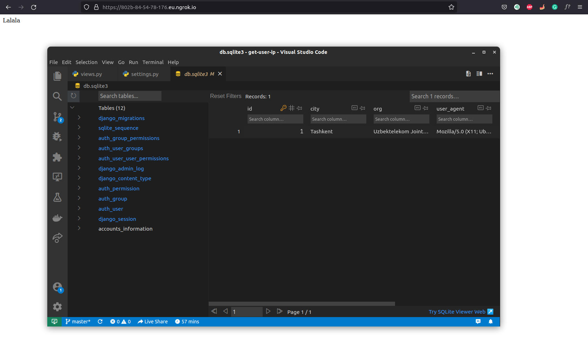

# Get User IP


Clone this repo, create virtual environment and activate it:

```bash
python -m venv env
source env/bin/activate
```

Install dependencies from requirements.txt:

```bash
pip install -r requirements.txt
```

Run your development server and **ngrok**:

```bash
python manage.py runserver
```

Before running ngrok, you should add your ngrok url to ALLOWED_HOSTS (settings.py).

```bash
ngrok http 8000
```




